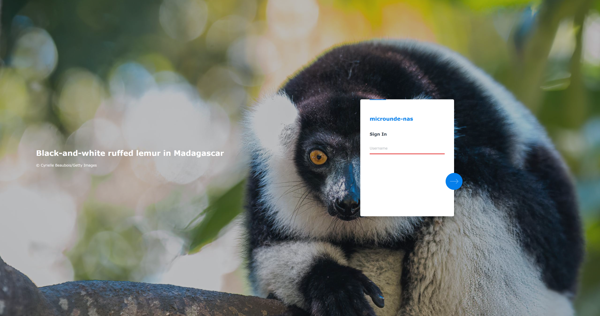
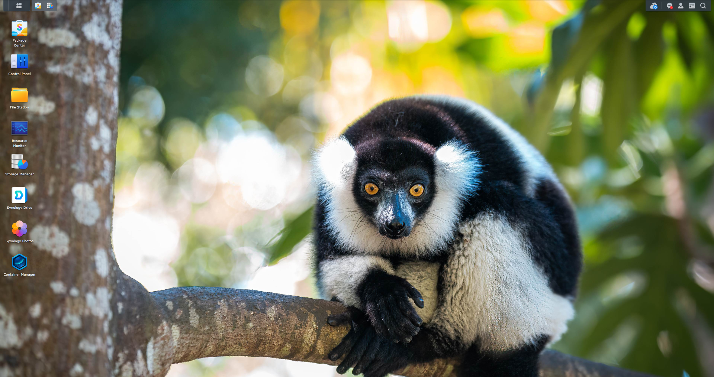

# **🖼️ Synology DSM 7.2 Bing Daily Wallpaper Script (4K)**

[](https://github.com/ventura8/Synology-DSM-Bing-Wallpaper-Auto-update)


This bash script automates the process of fetching the daily Bing wallpaper in **4K (UHD)** resolution and applying it to your Synology DSM 7.2 Login Screen. It intelligently extracts metadata to update the login screen's **Welcome Title** and **Message** with the image description and copyright credit.

## **📸 Screenshots**

| Login Screen | Desktop Environment View |
| :---- | :---- |
|  |  |
| *Fresh daily look from the moment you log in* | *Beautiful daily landscapes on your desktop* |

## **✨ Features**

* **High Resolution Support:** Supports **4K (UHD)** (default) and **1080p (FHD)**.
* **Global Region Support:** Choose your preferred Bing market (e.g., Worldwide, USA, England, Brazil, India, etc.).
* **Smart Metadata Extraction:**  
  * **📝 Title:** Sets the "Welcome Title" to the image description (e.g., *"Tufted titmouse perched on pine boughs..."*).  
  * **©️ Message:** Sets the "Welcome Message" to the photographer/agency credit (e.g., *"© Tim Laman/NPL/Minden Pictures"*).  
* **DSM 7 Native Support:** Updates both the legacy `/etc/synoinfo.conf` and the specific DSM 7 resource files (`dsm7_01.jpg`) to ensure the change is visible.  
* **🗄️ Detailed Archiving:** Optional archiving saves files with full metadata in the filename:  
  * Format: `YYYYMMDD - Image Title - Photographer Credit.jpg`  
  * Example: `20231027 - Tufted titmouse - Tim Laman.jpg`

## **📋 Prerequisites**

* Synology NAS running **DSM 7.x** (Tested on DSM 7.2).  
* **Root Access:** The script modifies system files, so it *must* be run as `root`.  
* `wget` (Standard on Synology systems).

> [!IMPORTANT]  
> This script requires root privileges to overwrite system files in `/usr/syno/`. Ensure you schedule the task as the root user.

## **⚙️ Installation & Setup**

### **1\. Create the Script**

1. Enable SSH on your Synology NAS (**Control Panel** \> **Terminal & SNMP**) or use the **Text Editor** package in DSM.  
2. Create a directory for your scripts (e.g., `/volume1/homes/admin/scripts/`).  
3. Save the script code into a file named `update_wallpaper.sh`.

### **2\. Configuration**

Open the script and adjust the configuration variables at the top.  
**Resolution & Archiving:**

```bash
# 1. Resolution Options
# Choose between "4k" (UHD) or "1080p" (FHD).
BING_RESOLUTION="4k"

# 2. Region Options (Default: en-WW)
BING_MARKET="en-WW"

# 3. Archiving Options (Default: false)
ENABLE_ARCHIVE=false
SAVE_PATH="/volume1/web/wallpapers"
```

Supported Region Codes:
| Code | Region | Code | Region |
| :--- | :--- | :--- | :--- |
| en-WW | Worldwide | en-IN | India |
| en-US | USA | it-IT | Italy |
| en-AU | Australia | ja-JP | Japan |
| pt-BR | Brazil | en-NZ | New Zealand |
| en-CA | Canada | es-ES | Spain |
| zh-CN | China | en-GB | England (UK) |
| fr-FR | France | en-SG | Singapore |
| de-DE | Germany | | |

> [!TIP]  
> If enabling archiving, ensure that `/volume1/web/` exists, or change `SAVE_PATH` to a valid shared folder path (e.g., `/volume1/photo/Bing`).

### **3\. Make Executable**

If you created the file via SSH, make it executable:

```bash
chmod +x /volume1/homes/admin/scripts/update_wallpaper.sh
```

## **🤖 Automation (Task Scheduler)**

To have the wallpaper update automatically every day:

1. Log in to DSM.  
2. Go to **Control Panel** \> **Task Scheduler**.  
3. Click **Create** \> **Scheduled Task** \> **User-defined script**.  
4. **General Tab:**  
   * **Task:** `Bing Wallpaper Update`
   * **User:** `root` 🔴 *(Critical: Must be root)*  
5. **Schedule Tab:**  
   * **Run on the following days:** Daily.  
   * **First run time:** `01:00` (or any time after midnight).  
6. **Task Settings Tab:**  
   * **Option A (File Method):** Enter the path to your script:
     
     ```bash
     bash /volume1/homes/admin/scripts/update_wallpaper.sh
     ```

   * **Option B (Direct Paste):** Alternatively, you can simply **copy the entire contents** of the script and paste it directly into the "User-defined script" text box. This works without needing to save a `.sh` file on your system.  
7. Click **OK**.

> [!NOTE]  
You can test it immediately by right-clicking the task and selecting Run.

## **🔍 How It Works**

1. **Fetching:** Calls the Bing `HPImageArchive` API to get the JSON data for the daily image.  
2. **Parsing:**  
   * Uses `grep` and `sed` to parse the JSON.  
   * Splits the copyright string `Description (© Credit)` into two separate variables: `TITLE` and `COPYRIGHT`.  
3. **System Update:**  
   * Modifies `/etc/synoinfo.conf` to set `login_welcome_title` and `login_welcome_msg`.  
   * Copies the image to `/usr/syno/etc/login_background.jpg`.  
4. **DSM 7 Override:**  
   * Overwrites the default resource file at `/usr/syno/synoman/webman/resources/images/2x/default_wallpaper/dsm7_01.jpg`.

## **🛠️ Troubleshooting**

| Issue | Solution |
| :---- | :---- |
| **Permissions Error** | Ensure the task is running as **root**, not your admin user. |
| **Image Not Changing** | Try clearing your browser cache or opening the login page in Incognito mode. DSM caches background images aggressively. |
| **DSM Updates** | Major DSM updates often reset system files. If the wallpaper stops updating after an update, run the script manually once to re-apply the changes. |

## **🛠️ Development & Testing**

This project maintains high code quality standards:

*   **Mandatory Coverage:** 90%+ code coverage is required for all changes.
*   **Local Testing:** Use the provided PowerShell script to run tests locally via Docker.
*   **Badge Updates:** The coverage badge is **not** updated by CI. You must update it locally before pushing:
    ```powershell
    ./run_tests_local.ps1
    ```
    This script will run Unit, Component, and E2E tests, merge coverage reports, and update `assets/coverage.svg`.

## **⚠️ Disclaimer**

> [!WARNING]  
> This script modifies system configuration files (`synoinfo.conf`) and internal resources. While generally safe and widely used in the Synology community, use it at your own risk. Always keep a backup of important data.
